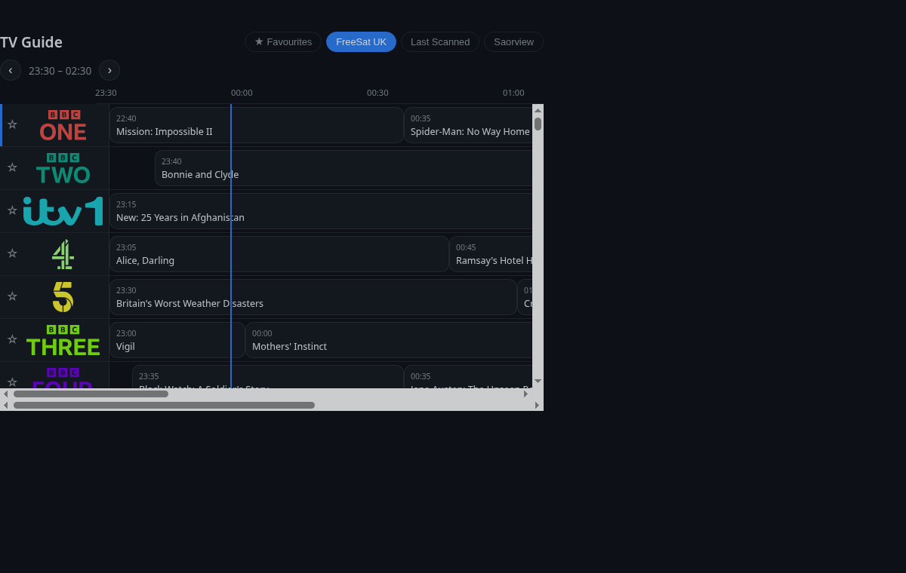
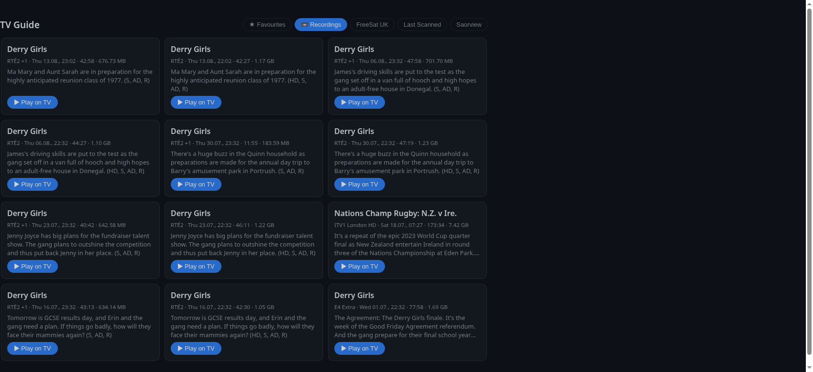

# OpenWebif Control Card

[](https://github.com/hacs/integration)

A modern, minimalist, themeable **Home Assistant Lovelace card** for
Enigma2 / OpenWebif receivers (Vu+, Dreambox, Zgemma, etc.).

This is the **dashboard companion** to the
[OpenWebif Control integration](https://github.com/kevpatts/OpenWebif-control).
The integration provides the data and control entities; this card renders a
**Sky Q-style channel grid** on top of them.

> **v0.8 — header controls + instant tabs.** Standard receiver controls
> (power/standby, channel ±, volume ±, mute, info) sit beside the heading.
> All bouquet tabs now **pre-load and cache their EPG in the background**, so
> switching between them is instant. Large bouquets are **virtualised** so the
> guide no longer freezes the browser on big channel lists.





---

## Features

- **Header controls** — standard receiver controls sit beside the card
  heading: **power** (toggle standby; green when on, red in standby),
  **channel up/down**, **volume up/down**, **mute**, and **info**. They call
  the integration's `toggle_standby` / `remote_control` services.
- **Instant tabs (background pre-load + cache)** — every bouquet tab's EPG is
  fetched and cached in the background shortly after the card loads (throttled,
  one bouquet at a time so the box stays responsive). Switching tabs is
  immediate — no first-visit load spinner.
- **Virtualised guide** — only the channel rows near the viewport are rendered,
  so even large bouquets (hundreds of channels) never build a huge DOM. This
  fixes the browser **"page unresponsive"** freeze that could happen when
  switching to a big tab.
- **Timeline EPG grid** — channels as rows, time along the top, with a live
  "now" line. Scroll horizontally through the guide; step the window earlier/
  later. Configurable number of visible **rows**.
- **Tap a programme** to open details, then **Watch** (zap) or **Record**
  (adds a timer via the integration).
- **Favourites** — star any channel; a **★ Favourites** tab shows just those.
  Favourites are stored per-browser (localStorage).
- **Bouquet tabs** along the top (FreeSat categories, Saorview, etc.).
- **Recordings** — a **📼 Recordings** tab lists everything recorded on the box
  (title, channel, date, size, description). Each has a **timeline scrubber**
  sized to the original show: click anywhere on it to start playback on the TV
  from roughly that point, or hit ▶ to play from the start.
  (Seeking is approximate — it uses the receiver's decile jump keys.)
- **Channel logos (picons)** resolved automatically from the public
  [`picons/picons`](https://github.com/picons/picons) set via jsDelivr —
  **no picon pack needs to be installed on your box** — cached after first load
  so tab switches are instant. Text-tile fallback for unmatched channels.
- **HA-native theming** — colours come from your Home Assistant theme's CSS
  variables (light/dark/custom); dark-mode picon variants used automatically.
- Highlights the **currently-tuned** channel.

---

## Requirements

1. The [**OpenWebif Control** integration](https://github.com/kevpatts/OpenWebif-control)
   (v0.1.1+) installed and configured — it provides the `*_channels` sensor and
   the `zap` service this card uses.
2. Home Assistant 2024.1.0 or newer.
3. **The receiver's resume prompt must be disabled** for recording playback
   to work without a modal blocking it — see below.

---

## Receiver setup: disable the resume prompt

> **Do this once on the box.** When you start a recording, Enigma2 can pop up a
> **“Resume from last position?”** dialog. That modal blocks the automated
> playback/seek this card triggers, so it **must be disabled**. With it off,
> ▶ Play and the timeline scrubber work cleanly. See the
> [integration README](https://github.com/kevpatts/OpenWebif-control#receiver-setup-disable-the-resume-prompt)
> for the full walkthrough. In short, on the box:
>
> **Menu → Setup → System → Recording (paths) / Playback →
> “Ask about resuming a movie” → set to `no`** (exact wording varies by
> OpenViX / image version; look for the movie *resume* option).

---

## Installation (HACS)

1. **HACS → three-dot menu → Custom repositories.**
2. Add `https://github.com/kevpatts/OpenWebif-control-card` with category
   **Dashboard** (a.k.a. Plugin/Lovelace).
3. Install **OpenWebif Control Card** and **reload your browser** (HACS will
   add the resource automatically; if not, add
   `/hacsfiles/OpenWebif-control-card/openwebif-control-card.js` as a
   `module` resource under **Settings → Dashboards → Resources**).

### Manual installation

Copy `dist/openwebif-control-card.js` into `config/www/` and add it as a
dashboard resource of type **JavaScript Module**.

---

## Usage

Add the card to a dashboard (it appears in the card picker as **OpenWebif
Control Card**), or via YAML:

```yaml
type: custom:openwebif-control-card
title: TV Guide
rows: 8
hours: 3
```

### Options

| Option | Type | Default | Description |
| --- | --- | --- | --- |
| `type` | string | — | `custom:openwebif-control-card` (required) |
| `title` | string | `TV Guide` | Card heading |
| `rows` | number | `8` | Number of channel rows visible before scrolling |
| `hours` | number | `3` | Hours of the timeline visible per screen |
| `slot_minutes` | number | `30` | Time-tick granularity on the header |
| `channels_entity` | string | auto | Override the `*_channels` sensor (auto-detected) |
| `current_entity` | string | auto | Override the `*_current_programme` sensor used to highlight the tuned channel |

> **Requires integration v0.2.0+** for the `get_epg` service and `bouquet_refs`.

### Theming overrides

The card uses your HA theme by default. You can fine-tune it with card-level
CSS variables via `card_mod` or a theme:

| Variable | Purpose |
| --- | --- |
| `--owc-accent` | Accent / active highlight colour |
| `--owc-radius` | Tile corner radius |
| `--owc-gap` | Grid gap |
| `--owc-tile-bg` | Tile background |

---

## Development

```bash
npm install
npm run build   # outputs dist/openwebif-control-card.js
npm run watch   # rebuild on change
```

The card is built with **Lit + TypeScript** and bundled with Rollup.

## License

[MIT](LICENSE)
